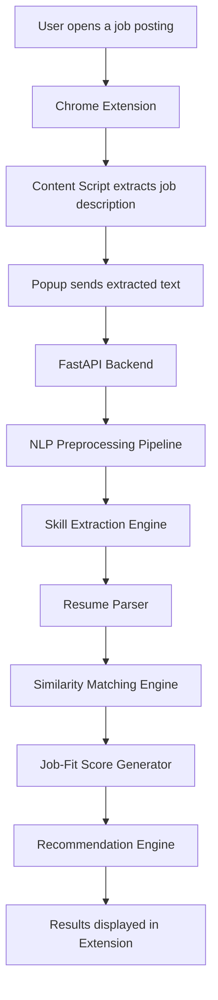
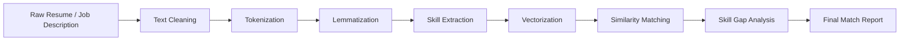

# AI-JobLens

**AI-JobLens** is an AI-powered Chrome extension and Python-based NLP system that analyzes job descriptions, extracts role-specific skills, compares them with resume content, and generates a personalized job-fit score with skill gap recommendations.

The project combines **Natural Language Processing, Machine Learning, semantic similarity, resume parsing, FastAPI, and JavaScript-based Chrome Extension development** to solve a real-world career-tech problem.

---

## Overview

Job seekers often apply to roles without knowing how well their resume actually matches the job description. Job descriptions contain important skills, hidden ATS keywords, preferred tools, responsibilities, and role-specific expectations that are easy to miss manually.

AI-JobLens converts unstructured job descriptions into structured job intelligence.

It extracts skills from a job posting, compares them with a candidate resume, calculates a match score, identifies missing skills, and provides improvement suggestions before the user applies.

---

## Core Features

- Real-time job description extraction from browser pages
- NLP-based skill extraction from job descriptions
- Resume text parsing and candidate skill identification
- Resume-job match score generation
- Missing skill and keyword gap detection
- Role category classification
- ATS keyword coverage analysis
- Personalized resume improvement recommendations
- JavaScript Chrome Extension interface
- Python FastAPI backend for ML/NLP processing

---

## AI/ML Capabilities

AI-JobLens uses NLP and ML techniques to understand both resumes and job descriptions.

### NLP Processing

- Text cleaning
- Tokenization
- Stopword removal
- Lemmatization
- Keyword extraction
- Skill entity detection
- Role-specific term extraction

### Machine Learning and Similarity Matching

- TF-IDF vectorization
- Cosine similarity
- Semantic similarity
- Skill overlap scoring
- Missing skill penalty
- Role relevance scoring
- Job-fit score calculation

---

## System Architecture



---

## NLP Pipeline



---

## How AI-JobLens Works

1. The user opens a job posting in the browser.
2. The Chrome extension extracts the visible job description from the page.
3. The extracted text is sent to the Python FastAPI backend.
4. The NLP pipeline processes the job description and extracts important skills.
5. The resume parser extracts skills and keywords from the candidate resume.
6. The matching engine compares resume content with job requirements.
7. The system calculates a match score and detects missing skills.
8. The extension displays the final job-fit report to the user.

---

## Match Score Logic

The final resume-job match score is calculated using multiple weighted components.

```text
Final Match Score =
    Skill Match Score
  + Semantic Similarity Score
  + Role Relevance Score
  + Keyword Coverage Score
  - Missing Skill Penalty
```

### Scoring Components

| Component | Description |
|---|---|
| Skill Match Score | Measures direct overlap between resume skills and job-required skills |
| Semantic Similarity | Compares contextual meaning between resume and job description |
| Role Relevance | Checks how closely the resume aligns with the detected job role |
| Keyword Coverage | Measures ATS-relevant keyword presence |
| Missing Skill Penalty | Reduces score for important missing skills |

---

## Example Output

```json
{
  "role_detected": "AI/ML Intern",
  "match_score": 78,
  "matched_skills": [
    "Python",
    "Machine Learning",
    "Data Preprocessing",
    "scikit-learn",
    "GitHub"
  ],
  "missing_skills": [
    "TensorFlow",
    "FastAPI",
    "SQL",
    "Model Deployment"
  ],
  "ats_keywords": [
    "feature engineering",
    "model evaluation",
    "classification",
    "REST API",
    "NLP"
  ],
  "recommendations": [
    "Add one deployed ML project using FastAPI or Streamlit.",
    "Mention model evaluation metrics such as accuracy, precision, recall, and F1-score.",
    "Include SQL if applying for data-focused roles.",
    "Add NLP-related keywords if targeting AI/ML internships."
  ]
}
```

---

## Tech Stack

### AI/ML and NLP

- Python
- scikit-learn
- spaCy
- NLTK
- Sentence Transformers
- TF-IDF
- Cosine Similarity
- Text preprocessing
- Semantic similarity

### Backend

- FastAPI
- Python REST APIs
- Pydantic
- Resume parsing modules
- NLP inference pipeline
- JSON-based API communication

### Chrome Extension

- JavaScript
- Chrome Extension Manifest V3
- Content Scripts
- DOM text extraction
- Chrome Storage API
- Popup-based user interface

### Data Handling

- JSON
- CSV
- Skill dictionaries
- Resume text data
- Job description text data

---

## Repository Structure

```text
AI-JobLens/
│
├── backend/
│   ├── main.py
│   ├── api_routes.py
│   ├── resume_parser.py
│   ├── jd_analyzer.py
│   ├── skill_extractor.py
│   ├── similarity_engine.py
│   └── recommendation_engine.py
│
├── ml/
│   ├── preprocessing.py
│   ├── vectorizer.py
│   ├── role_classifier.py
│   ├── scoring_model.py
│   └── skill_taxonomy.py
│
├── extension/
│   ├── manifest.json
│   ├── popup.js
│   ├── content.js
│   ├── background.js
│   └── popup.css
│
├── data/
│   ├── skills_dictionary.json
│   ├── sample_resumes/
│   └── sample_job_descriptions/
│
├── notebooks/
│   ├── skill_extraction_experiments.ipynb
│   └── similarity_model_testing.ipynb
│
├── tests/
│   ├── test_skill_extractor.py
│   ├── test_similarity_engine.py
│   └── test_resume_parser.py
│
├── requirements.txt
└── README.md
```

---

## Backend API Design

The backend exposes REST APIs for job description analysis, resume parsing, and resume-job matching.

### Analyze Job Description

```http
POST /analyze-jd
```

#### Request

```json
{
  "job_description": "We are looking for an AI/ML intern with Python, machine learning, NLP, SQL, and deployment knowledge."
}
```

#### Response

```json
{
  "role": "AI/ML Intern",
  "required_skills": [
    "Python",
    "Machine Learning",
    "NLP",
    "SQL",
    "Deployment"
  ],
  "keywords": [
    "model training",
    "data preprocessing",
    "feature engineering",
    "REST API"
  ]
}
```

---

### Match Resume With Job

```http
POST /match-resume
```

#### Request

```json
{
  "resume_text": "Python, Machine Learning, scikit-learn, data preprocessing, GitHub, classification models.",
  "job_description": "Looking for an ML intern with Python, NLP, SQL, FastAPI, and deployment experience."
}
```

#### Response

```json
{
  "match_score": 74,
  "matched_skills": [
    "Python",
    "Machine Learning",
    "scikit-learn"
  ],
  "missing_skills": [
    "NLP",
    "SQL",
    "FastAPI",
    "Deployment"
  ],
  "recommendations": [
    "Add NLP-related project keywords.",
    "Mention FastAPI or REST API experience.",
    "Include SQL if applying for data-focused roles.",
    "Add one deployed ML project to improve ML engineering alignment."
  ]
}
```

---

## Role Classification

AI-JobLens classifies job postings into role categories based on extracted skills and job context.

Supported categories include:

- AI/ML Engineer
- Data Scientist
- Data Analyst
- NLP Engineer
- Python Developer
- Backend Developer
- Full Stack Developer
- Software Development Engineer
- ML Intern
- Data Engineering Intern

---

## Skill Gap Analysis

The skill gap engine compares candidate skills with job-required skills and separates them into three categories.

| Category | Meaning |
|---|---|
| Strong Match | Skills clearly present in the resume |
| Partial Match | Related skills found but not directly mentioned |
| Missing Skill | Important job-required skills absent from the resume |

Example:

```text
Strong Match:
- Python
- Machine Learning
- GitHub

Partial Match:
- Model building
- Data preprocessing

Missing Skill:
- FastAPI
- SQL
- TensorFlow
- Deployment
```

---

## Recommendation Engine

The recommendation engine converts skill gaps into practical improvement suggestions.

Example recommendations:

```text
- Add a deployed ML project using FastAPI or Streamlit.
- Mention Python libraries such as NumPy, pandas, scikit-learn, and matplotlib.
- Include evaluation metrics such as accuracy, precision, recall, F1-score, and confusion matrix.
- Add SQL if applying to data analyst or data science roles.
- Add NLP keywords if targeting AI/ML or NLP internships.
```

---

## Installation and Setup

### 1. Clone the Repository

```bash
git clone https://github.com/poorvanshi10/AI-JobLens.git
cd AI-JobLens
```

### 2. Create Virtual Environment

```bash
python -m venv venv
```

### 3. Activate Virtual Environment

For Windows:

```bash
venv\Scripts\activate
```

For macOS/Linux:

```bash
source venv/bin/activate
```

### 4. Install Dependencies

```bash
pip install -r requirements.txt
```

### 5. Start FastAPI Backend

```bash
uvicorn backend.main:app --reload
```

### 6. Load Chrome Extension

1. Open Chrome.
2. Go to `chrome://extensions`.
3. Turn on Developer Mode.
4. Click **Load unpacked**.
5. Select the `extension/` folder.
6. Open any job posting page and run AI-JobLens.

---

## Sample Use Case

A candidate applying for an AI/ML internship opens a job description requiring Python, NLP, SQL, model evaluation, and deployment.

AI-JobLens extracts the required skills, compares them with the candidate resume, and generates:

```text
Detected Role: AI/ML Intern
Match Score: 78%

Matched Skills:
Python, Machine Learning, scikit-learn, Data Preprocessing

Missing Skills:
SQL, FastAPI, NLP, Deployment

Recommendation:
Add one ML deployment project and mention NLP-related keywords to improve role alignment.
```

---

## Why This Project Stands Out

AI-JobLens is not a basic Chrome extension. It is a full AI-powered system that combines browser automation with a Python ML backend.

This project demonstrates:

- Practical AI/ML application
- NLP pipeline design
- Resume parsing
- Job description analysis
- Similarity scoring
- FastAPI backend development
- JavaScript extension development
- End-to-end product thinking
- Real-world career-tech problem solving

---

## Key Learning Outcomes

This project demonstrates hands-on understanding of:

- Natural Language Processing
- Machine Learning pipelines
- Text vectorization
- Cosine similarity
- Resume-job matching
- Skill extraction
- FastAPI REST API development
- JavaScript DOM extraction
- Chrome Extension Manifest V3
- API integration between frontend and backend

---

## Author

**Poorvanshi Lowanshi**

Aspiring AI/ML Engineer focused on building practical projects using Python, Machine Learning, NLP, JavaScript, and intelligent automation.

---

## Project Summary

AI-JobLens is an AI-powered resume-job matching system built as a Chrome extension with a Python NLP backend. It helps candidates analyze job descriptions, identify missing skills, improve resume-job alignment, and make smarter job application decisions using machine learning and natural language processing.
